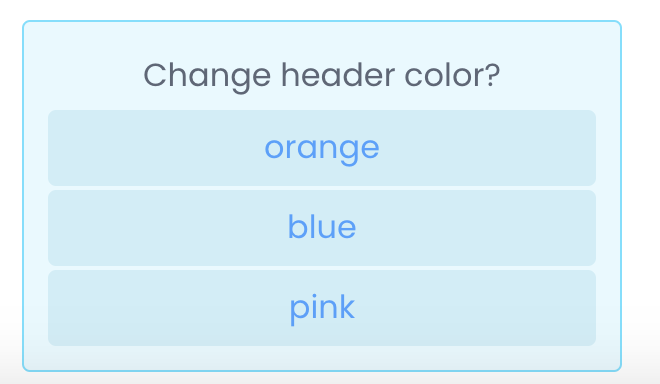

# Note.js

Note.js is a library that generates customizable and interactive notifications. The notifications ("notes") can take the form of toast messages, or they can attach themselves to different positions of any element. Notifications can be built easily with the provided components.

## Link to Note.js landing page
https://secure-spire-81099.herokuapp.com/

## Getting Started
1. make sure you have jQuery.
2. download note.js and note-styles.css from landing page
3. add note.js and note-styles.css to your HTML:

```HTML
<!-- library css-->
<link rel="stylesheet" href="note-styles.css" />

<!-- library js-->
<script type="text/javascript" src="Note.js"></script>
```

## Examples
(See landing page for interactive examples.)

First create a noteGenerator to generate notes:
```Javascript
const noteGen = new Note()
```
To create a new Note:
```Javascript
// with createNote():
const toast = noteGen.createNote().addText("hello")

// or use templates:
const toast = noteGen.makeToast("hello")

/* the two options above achieve the same result */
```


You can display the note you created on the viewport (attach to body):
```Javascript
toast.display("top-center")
```
Or display the note relative to some element (attached to target element):
```Javascript
toast.display("bot-center", target)
```


You can add/replace/remove text and buttons:
```Javascript
const note = noteGen
	.createNote()
	.addText("Change header color?")
	.addButtons(["orange", "blue", "pink"])
```


Wait for click:
```Javascript
let result = note.waitForResponse()
result.then((res) => console.log(res))
// logs out the text of the button clicked
```


